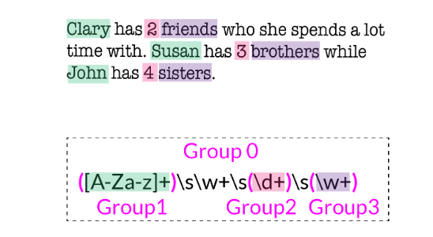
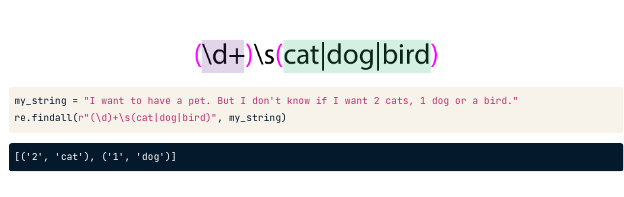
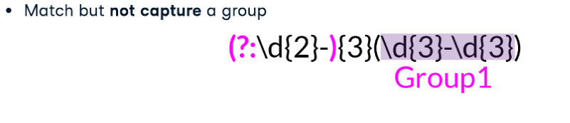
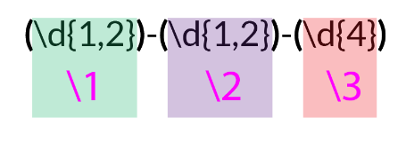

## 1. Basic Concepts of String Manipulation
- Concatenation: ```string1 + string2```
- Indexing: ```my_string[index]```
- Slicing: ```my_string[start_index:end_index-1]```
- Stride: ```my_string[start_index:end_index:stride]```
#
### 1.1 String Operation
- **Adjusting cases**: 
```py
# lowercase
my_string.lower()
# uppercase
my_string.upper()
# capitalizing
my_string.capitalize()
```
- **Splitting**:
```py
my_string.split(sep=" ", maxsplit=2)
#['This','string','will be split']
my_string.rsplit(sep=" ", maxsplit=2)
#['This string will 'be','split']
my_string = 'This string will \n be split'

my_string.splitlines() # bearking at line boundaries
```
- **Joining**
```py
my_list = ['this','would','be','a','string']
print(" ".join(my_list))
```
- **Stripping**
```py
my_string = 'This string will \n be split'
my_string.strip()
```
### 1.2 Finding and Replacing
- **Finding Substrings**
```py
string.find(substring, start, end)

my_string = "Where's am I ? "
my_string.find("Where")
```
- **Index Function**
```py
string.index(substring, start, end)

my_string = "Where's am I ? "
my_string.index("Where")
```
- **Counting Occurrences**
```py
string.count(substring, start, end)

my_string = "Where's am I am  ? "
my_string.count("am")
```
- **Replacing Substrings**
```py
string.replace(old_string, new_string, count_string_to_replace)

my_string = "Where's am I am  ? "
my_string.count("am")
```
# 

## 2. Formatting Strings
### 2.1 Positional formatting `str.format()`
- Reodering values:
```
print("{1} has a friend called {0}".format("A","B"))
```
- Named placholders
```py
tool = "Unsupervised algorithms"
goal = "patterns"
print("{title} try to find {aim} in the dataset".format(title=tool, aim=goal))
```
- Format specier:
```py
print("Only {0:f}% of the {1} produced worldwide is {2}!".format(0.5155675, "data", "analyzed"))

# Only 0.515568% of the data produced worldwide is analyzed 1
```
- Formatting datetime:
```py
from datetime import datetime
print(datetime.now())

print("Today's date is {:%Y-%m-%d %H:%M}".format(datetime.now()))
# Today's date is 2019-04-11 20:20
```

### 2.2 Formatted string literals
- f-strings: `f"literal string{expression}"`
- Type Conversion:
     - !s (string version)
     - !r (string containing a printable representation)
     - !a (some that !r but escape the none-ASCII characters)
```py
name = "Python"
print(f"Python is called {name!r} )
# Python is called 'Python' 
```
- Format speciers:
    - e (scientic notation, e.g. 5 10^3)
    - d (digit, e.g. 4)
    - f (float, e.g. 4.5353)
    - datetime
```py
print(f"In the last 2 years, {number:.2f}% of the data was produced worldwide!")
# In the last 2 years, 90.42% of the data was produced worldwide!

print(f"Today's date is {my_today:%B %d, %Y}")
# Today's date is April 14, 2019
```
- Index lookups:
    - Use quotes for index lookups: family["dad"]
```py
family = {"dad": "John", "siblings": "Peter"}

print(f"Is your dad called {family[dad]}?")
# NameError: name 'dad' is not defined

print(f"Is your dad called {family["dad"]}?")
# John
```

- Escape sequences
    - Escape sequences: backslashes\
```py
my_string = "My dad is called \"John\""
# My dad is called "John"
```
- Inline operations:
    - Advantage: evaluate expressions and call functions inline
```py
my_number = 4
my_multiplier = 7
print(f'{my_number} multiplied by {my_multiplier} is {my_number * my_multiplier}')
# 4 multiplied by 7 is 28
```
- Calling functions:
```py
def my_function(a, b):return a + b

print(f"If you sum up 10 and 20 the result is {my_function(10, 20)}")
# If you sum up 10 and 20 the result is 30

```
#

## 3. Regular Expressions for Pattern Matching
### 3.1 The re module
- Find all matches of a pattern: `re.findall(r"regrex", string)`
```py
re.findall(r"#movies", "Love #movies! I had fun yesterday going to the #movies")

# ['#movies', '#movies']

```
- Split string at each match: `re.split(r"regrex", string)`

```py
re.split(r"!", "Nice Place to eat! I'll come back! Excellent meat!")
# ['Nice Place to eat', " I'll come back", ' Excellent meat', '']

```
- Replace one or many matches with a string: `re.sub(r"regrex", new, string)`

```py
re.sub(r"yellow", "nice", "I have a yellow car and a yellow house in a yellow neighborhood")
# 'I have a nice car and a nice house in a nice neighborhood'
```
### 3.2 Supported metacharacters
|Metacharacter|Meaning|
|-------------|---------|
|\d|Digit|
|\D|Non-digit|
|\w|Word|
|\W|None-word|
|\s|Whitespace|
|\S|Non-Whitespace|

### 3.3 Repetitions
|Quantiers|Meaning|
|-------------|---------|
|{}|Repeated characters|
|+|(Once or more) match as many characters as possible|
|*|(Zero times or more) match as many characters as possible|
|?|(Zero times or once) match as few characters as needed|
|{n, m}|n times at least, m times at most |

### 3.4 Looking for patterns
|Special characters|Meaning|
|-------------|---------|
|.|Match any character(except newline)|
|^|Start of the string|
|$|End of the string|
| \ or \ . or \ * or \ \ |Escape special characters|
| [] |Set of characters|

### 3.5 Group and Lookaround
|Special characters|Meaning|
|-------------|---------|
|(abc)|capture group|
|\1|backreference to group #1|
|?P < name > |Give a name to groups|
|?:abc|non-capturing group|
|?=abc|positive lookahead|
|?!abc|negative lookahead|

#

## 4. Advanced Regular Expression Concepts
### 4.1 Grouping and capturing
- Group characters `()`:



```py
text = "Clary has 2 dogs but John has 3 cats"

re.findall(r'([A-Za-z]+)\s\w+\s(\d+)\s(\w+)', text)

Output:
[('Clary', '2', 'friends'), 
('Susan', '3', 'brothers'), 
('John', '4', 'sisters')]
```

## 4.2 Alternation and non-capturing groups
- Pipe:
```py
my_string = "I want to have a pet. But I don't know if I want 2 cats, 1 dog or a bird."

re.findall(r"\d+\scat|dog|bird", my_string)

Output:
['2 cat', 'dog', 'bird']
```
- Alternation: Use groups to choose between optional patterns



- Non-capturing groups:
    - Match but not capture a group
    - When group is not backreferenced
    - Add `?: (?:regex)`



```py
my_string = "John Smith: 34-34-34-042-980, Rebeca Smith: 10-10-10-434-425"
re.findall(r"(?:\d{2}-){3}(\d{3}-\d{3})", my_string)

['042-980', '434-425']

```

## 4.3 Backreferences
- Using numbered capturing groups to reference back:



- Using named capturing groups to reference back:


## 4.4 Lookaround

- Look-ahead:`?=`


    - Positive Look-ahead: Checks that the first part of the expression is followed by the lookahead expression

```py
my_text = "tweets.txt transferred, mypass.txt transferred, keywords.txt error"
re.findall(r"\w+\.txt(?=\stransferred)", my_text)

Output:
['tweets.txt', 'mypass.txt']

```
    - Negative look-ahead: Checks that the first part of the expression is not followed by the lookahead expression 

```py
my_text = "tweets.txt transferred, mypass.txt transferred, keywords.txt error"
re.findall(r"\w+\.txt(?!\stransferred)", my_text)

Output:
['keywords.txt']
```

- Look-behind: `?<`


    - Positive Look-behind: Get all the matches that are preceded by a specific patern

```py
my_text = "Member: Angus Young, Member: Chris Slade, Past: Malcolm Young, Past: Cliff Williams."

re.findall(r"(?<=Member:\s)\w+\s\w+", my_text)

Output:
['Angus Young', 'Chris Slade']
```
    - Negative Look-behind: Get all the matches that are not preceded by a specific patern 

```py
my_text = "My white cat sat at the table. However, my brown dog was lying on the couch."

re.findall(r"(?<!brown\s)(cat|dog)", my_text)

Output:
['cat']
```